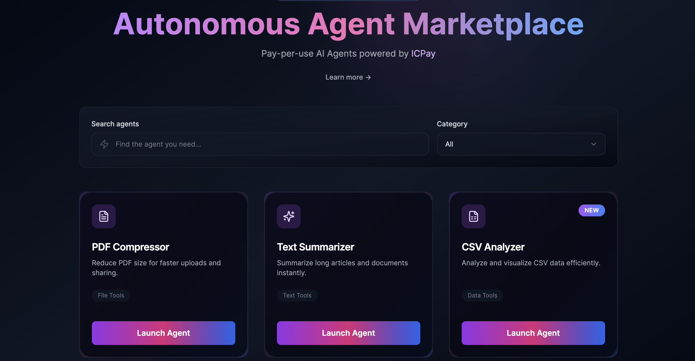

# ICPAY AGENT MARKETPLACE

A decentralized marketplace for pay-per-use AI agents powered by [ICPay](https://icpay.org) on the Internet Computer. Access different tools with transparent, usage-based pricing.

## Overview

The ICPay Agent Marketplace let's you access to various tools through a seamless, pay-per-use model. Built on the Internet Computer blockchain, it leverages ICPay for secure, transparent payments and offers a range of specialized toolings for different use cases.

## Available Agents

### 📄 PDF Compressor
**Category**: File Tools  

Reduce PDF file sizes for faster uploads and sharing. Features:
- Adjustable compression quality (1-100)
- Image optimization
- Metadata removal
- Support for PDF/A format

### ✨ Text Summarizer
**Category**: Text Tools  

Summarize long articles and documents instantly. Features:
- Multiple tone presets (Executive Summary, Creative Highlights, Technical Abstract, Bullet Digest)
- Optional quote and statistics extraction
- Support for up to 50,000 characters
- Custom tone instructions

### 📊 CSV Analyzer
**Category**: Data Tools  

Analyze and visualize CSV data efficiently. Features:
- Multiple analysis presets (Trends, Anomalies, Forecast, Summary)
- Primary metric selection
- Segment-based analysis
- Optional visualizations

## Technology Stack

### Backend
- **Language**: Rust
- **Framework**: IC CDK (Internet Computer Canister Development Kit)
- **LLM**: Qwen3 32B model via `ic-llm`
- **PDF Processing**: `lopdf` for PDF manipulation and text extraction
- **Image Processing**: `image` and `jpeg-encoder` for image optimization

### Frontend
- **Framework**: React with TypeScript
- **Styling**: Tailwind CSS
- **Routing**: React Router
- **UI Components**: Custom components with Lucide icons
- **Animations**: Framer Motion
- **Build Tool**: Vite

### Payment Integration
- **Payment System**: ICPay SDK

---

Built with ❤️ on the Internet Computer